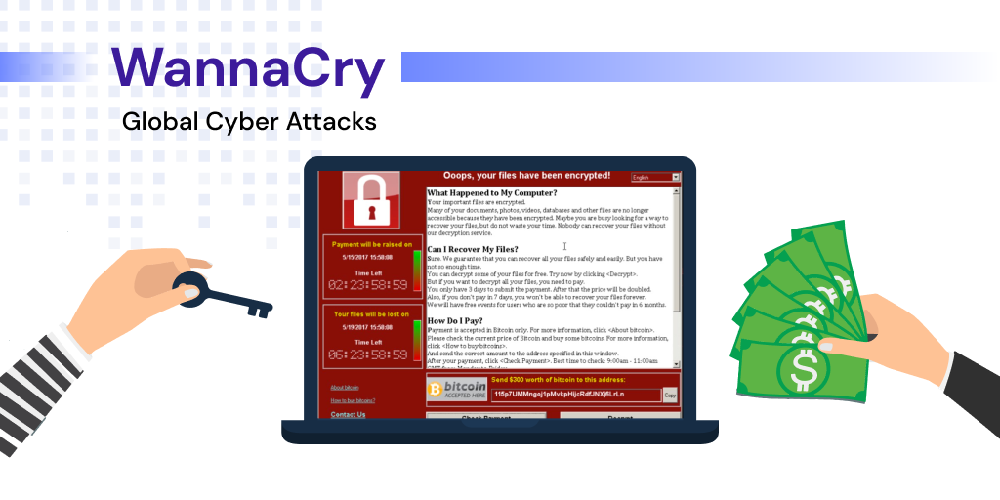
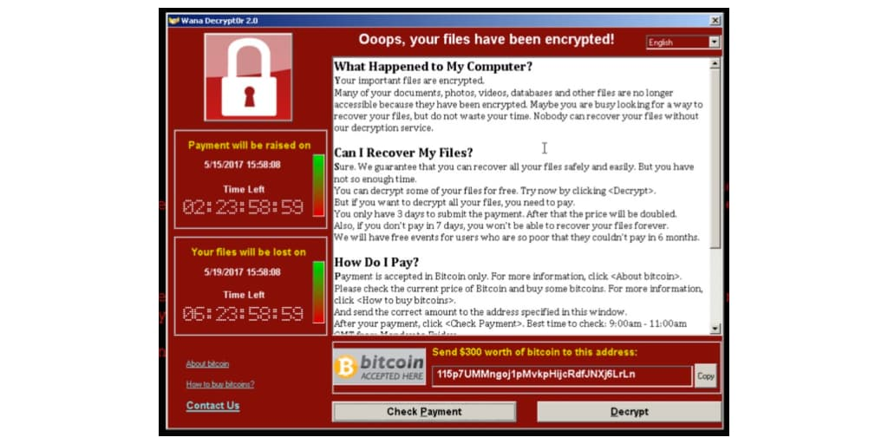

<!--StartFragment-->

It has been an interesting couple of days, starting with the initial news of a global ransomware attack on major media outlets on Friday, Mat 13th, 2017. The topic has been on the agenda of global news channels (<a href="https://edition.cnn.com/2017/05/14/opinions/wannacrypt-attack-should-make-us-wanna-cry-about-vulnerability-urbelis/index.html" target="_blank">CNN</a>), newspapers (<a href="https://www.wsj.com/articles/what-we-know-about-the-global-ransomware-attack-1494684034" target="_blank">Wall Street Journal</a>), as well as local security websites (<a href="https://krebsonsecurity.com/tag/wanna-cry-ransomware/" target="_blank">Krebs on Security</a>), and newsletters. By late Friday, we were all familiar with the now infamous screen informing the victim that his/her files have been encrypted and requesting a ransom payment to recover the files.

A lot of information is out there regarding what this threat is and how it works. I found these links especially useful in working with our clients to help them protect their systems from falling victim to this global threat:

\- <a href="https://www.troyhunt.com/everything-you-need-to-know-about-the-wannacrypt-ransomware/" target="_blank">Everything you need to know about the WannaCry / Wcry / WannaCrypt ransomware </a> by Troy Hunt

\- <a href="https://www.malwaretech.com/2017/05/how-to-accidentally-stop-a-global-cyber-attacks.html" target="_blank">How to Accidentally Stop a Global Cyber Attacks </a> by MalwareTech

Although the spread of the malware appeared to slow down due to the kill switch described in the article above from Malwaretech, a new version that was not impacted by this kill switch was already reported to be seen in the wild by Sunday.

By Monday, May 15th, we had reports of hundreds of thousands of machines infected worldwide, from individual home users to global corporations like FedEx Corp, Renault, Nissan, and Telefonica among them. The German rail operator Deutsche Bahn was an example of how an IT incident can cripple critical infrastructure.

<p class="aciklama">WannaCry Ransomware Attack

Although the spread of the malware appeared to slow down due to the kill switch described in the article above from Malwaretech, a new version that was not impacted by this kill switch was already reported to be seen in the wild by Sunday.

By Monday, May 15th, we had reports of hundreds of thousands of machines infected worldwide, from individual home users to global corporations like <a href="https://www.washingtonpost.com/news/the-switch/wp/2017/06/28/fedex-delivery-unit-hit-by-worldwide-cyberattack/" target="_blank">FedEx Corp</a>, <a href="https://www.marketwatch.com/story/wannacry-attack-hits-renault-200000-plus-victims-2017-05-15" target="_blank">Renault</a>, <a href="https://www.bbc.com/news/uk-england-39906534" target="_blank">Nissan</a>, and <a href="https://www.ibtimes.com/telefonica-wannacry-ransomware-one-spains-largest-telecom-companies-hit-cyberattack-2538211" target="_blank">Telefonica</a> among them. The German rail operator <a href="https://www.reuters.com/article/us-cyber-attack-germany-rail-idUSKBN1890DM" target="_blank">Deutsche Bahn</a> was an example of how an IT incident can cripple critical infrastructure.

<p class="aciklama">Global Effects of WannaCry Cyber Attack

It was interesting to see that the ransomware was using a known Windows vulnerability that Microsoft has issued a patch on March 14th with the MS17-010 Critical Security Bulletin. This showed us once more how critical it is to have a proactive and regular <a href="https://www.prplbx.com/security/vulnerabilitymanagement" target="_blank">Vulnerability and Patch Management</a> process. We have observed that our clients who have implemented automated and integrated security processes and solutions were not impacted by this global threat. The importance of the following initiatives was once more proven in the field:

\- Ongoing Vulnerability Scanning and Remediation

\- Automating Windows Updates

\- End-point Security and Anti-Virus

\- End-user Security and Phishing Awareness

<p class="aciklama">WannaCry cyberattack caused NHS operations to cease for several days, affecting hospitals and GP surgeries across England and Scotland

If you would like to learn more about how you can protect your business from similar threats in the future by implementing proactive and automated solutions, please <a href="https://www.prplbx.com/contact" target="_blank">get in touch with PurpleBox</a>.

<!--EndFragment-->