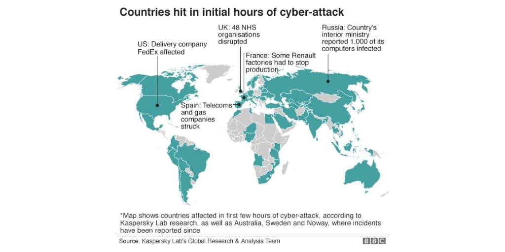

NOTE: This is the latest part of a blog series.

<a href="https://www.prplbx.com/resources/blog/qualys-patch-management" target="_blank">Part 1: Qualys Patch Management (PM)</a>

<a href="https://www.prplbx.com/resources/blog/qualys-endpoint-detection-and-response" target="_blank">Part 2: Qualys Endpoint Detection and Response (EDR)</a>

### Overview

In <a href="https://www.prplbx.com/resources/blog/qualys-endpoint-detection-and-response" target="_blank">Part 1</a> and <a href="https://www.prplbx.com/resources/blog/qualys-endpoint-detection-and-response" target="_blank">Part 2</a> of these blog series, we learned about Qualys Patch Management (PM) and Qualys Endpoint Detection and Response (EDR).

This blog post will be about patching with Qualys Patch Management (PM) and remediation with Qualys Endpoint Detection and Response (EDR).

### Index

<h3 style="margin-top:15px !important;">Part 1: Qualys Patch Management (PM)</h3>